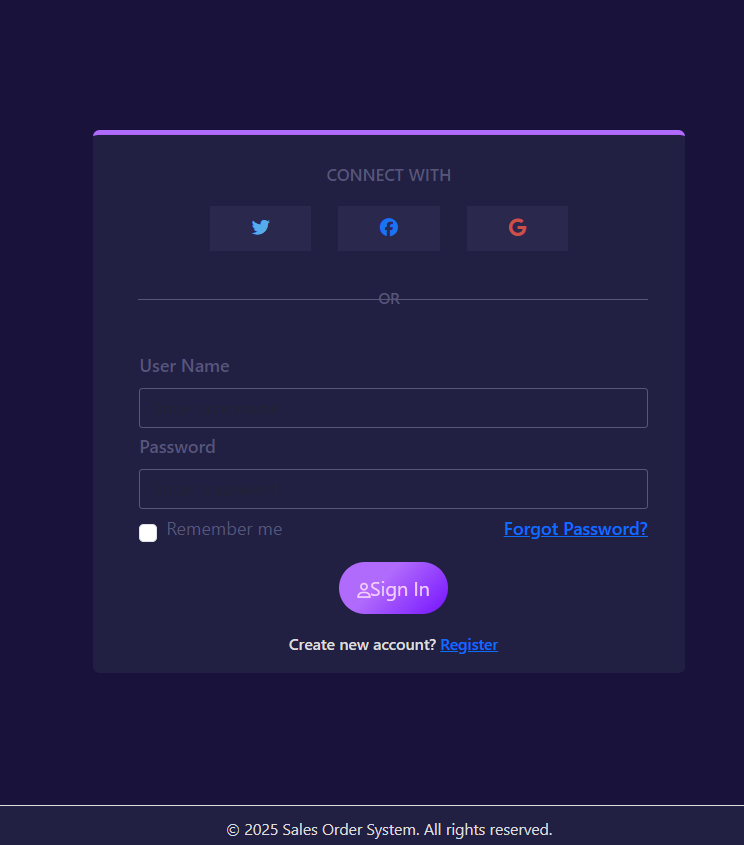
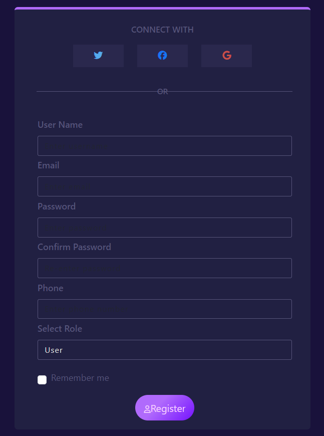
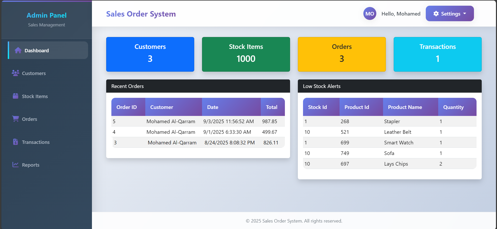
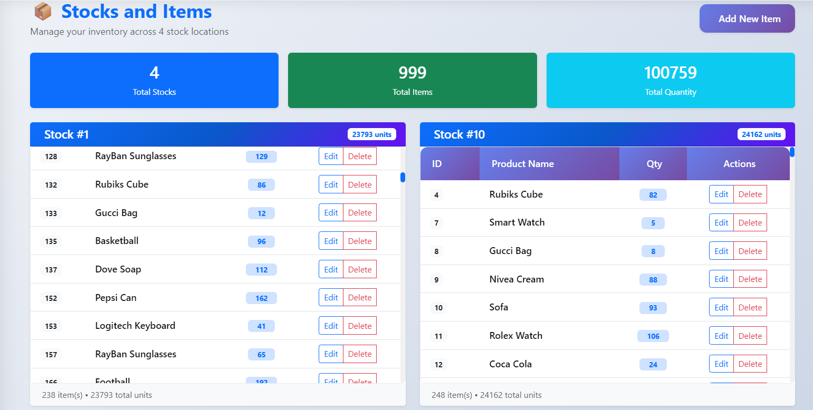
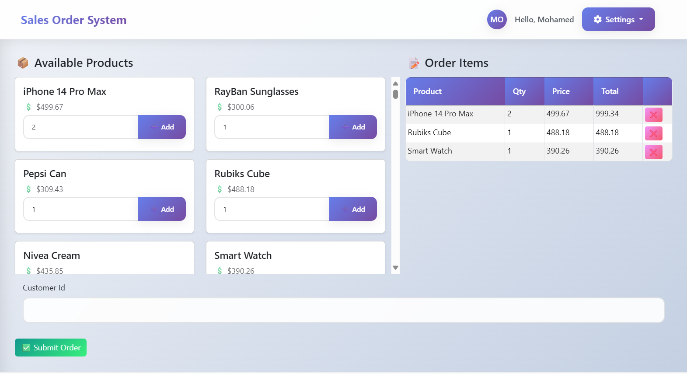

# 🛒 Sales Order Management System  

  
  
  

A **multi-tier ASP.NET Core MVC 8 web application** for managing **customers, sales orders, and inventory**.  
Includes **role-based authentication**, **dashboard with statistics**, **low-stock alerts**, and full **CRUD operations**.  

---

## 🚀 Features  

- 🔑 **Authentication & Authorization**  
  - Login & registration with ASP.NET Identity  
  - Roles: `Admin`, `Cashier`, `User`  

- 📊 **Admin Dashboard**  
  - Total Customers, Stock Items, Orders, Transactions  
  - Low stock item alerts  
  - Recent orders  

- 👥 **Customer Management** → Full CRUD operations  
- 📦 **Stock Management** → Monitor inventory and set thresholds  
- 📝 **Order Management** → Manage orders & order items  

---

## 🖼️ Screenshots  

👉 **Login Page**  
  
*User login with Identity authentication*  

👉 **Register Page**  
  
*New user registration with role assignment*  

👉 **Admin Dashboard**  
  
*Dashboard showing statistics, alerts, and recent orders*  

👉 **Stock Management**  
  
*CRUD operations for managing stock items and inventory*  

👉 **Order Management**  
  
*Create and manage customer orders with linked stock items*  

---

## 🏗️ Project Architecture  

This project follows **N-Tier Layered Architecture**:  

- **Model Layer** → `Customer`, `Order`, `OrderItem`, `Stock`, `StockItem`, `Product`, `Payment`, `Transaction`  
- **Core Layer** → Repository interfaces/contracts  
- **Data Access Layer (DAL)** → EF Core implementations of repositories  
- **Business Logic Layer (BLL)** → Business services  
- **UI Layer** → ASP.NET Core MVC 8 (Views, Controllers, Identity)  

---

## 🛠️ Tech Stack  

- **Backend:** ASP.NET Core MVC 8  
- **Database:** SQL Server + EF Core  
- **Authentication:** ASP.NET Identity  
- **Architecture:** N-Tier layered  

---

## 🔑 Roles  

| Role    | Permissions                  |
|---------|------------------------------|
| Admin   | Full control over the system |
| Cashier | Manage sales & transactions  |
| User    | Limited access               |
